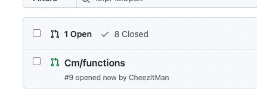
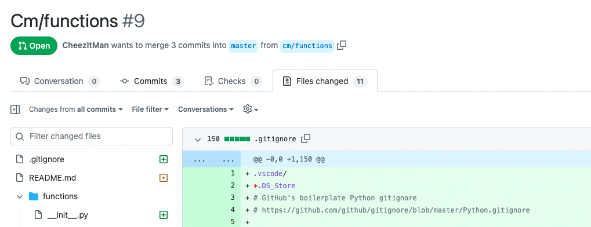
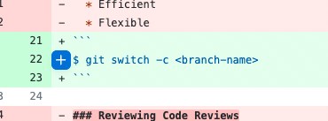
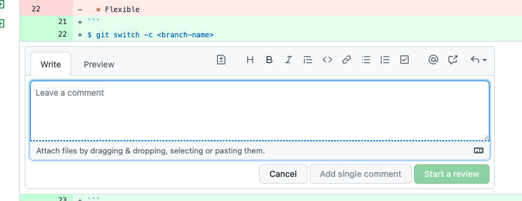

# Code Reviews

## Goals

The goal of this activity it to practice the code review process using [Github pull requests](https://docs.github.com/en/pull-requests/collaborating-with-pull-requests/proposing-changes-to-your-work-with-pull-requests/about-pull-requests).

## Instructions

In teams of 2-3:

1. Select one student who will fork and add teammates as collaborators.
1. Individually, clone the repository and select **one** (1) function from the [list of functions](./functions.md) to add.
1. Individually, create a branch, write your function and tests (the code is provided), commit your changes, and push the branch up to the remote repository.
   - For example: If **Jaeda** is working on the [`merge_sorted_lists`](./functions.md) function
     1. They could create a branch named `jaeda/merge_sorted_lists`
     1. Then write their code and tests
     1. Verify the code works by creating a virtual environment, installing the dependencies, and running the tests with `pytest`
     1. Then use `git add` and `git commit` to commit their changes
     1. Then use `git push origin jaeda/merge_sorted_lists` to push the branch up to Github
1. Open a pull request and add your teammates as reviewers.
1. As a team, review each pull request using Github, writing comments and suggestions.
   - Specifically, look for:
     - Style and readability issues
     - Efficiency issues
     - Testing Issues
   - In addition, look for items to praise and learn from

### To Review a Pull Request

In the Github repository, click on **Pull requests** and click on the pull request you want to review. Then select **Files changed**.

_Fig. Selecting a PR to Review_ 

_Fig. Selecting Files Changed_

 

Then we can click on the **+** sign to add comments to lines of code.

_Fig. Using the + sign to comment on a line_

 

_Fig. Writing a comment_

Finally, we will wrap up our review leaving a more general comment and **Comment**, **Approve** or **Request Changes** to submit.

