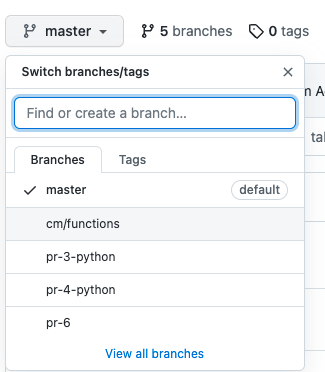
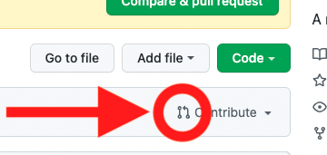
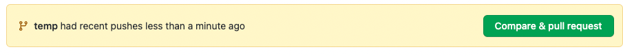
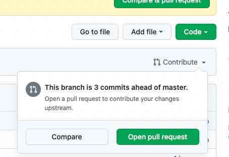
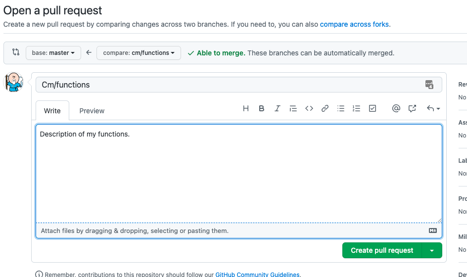
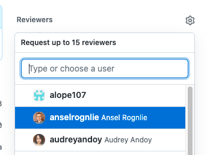

# Code Reviews

## Overview

This repository is designed to teach students the code review process using [Github pull requests](https://docs.github.com/en/pull-requests/collaborating-with-pull-requests/proposing-changes-to-your-work-with-pull-requests/about-pull-requests).  

## Instructions 

In teams of 2-3 students:

1. Select one student who will fork and add teammates as collaborators.
1. Clone the repository and each student selects **one** (1) function to write (below).
1. Create a branch, write their function, commit their changes and push the branch up to the remote repository.
1. Open a pull request and add their teammates as reviewers.
1. As a team review each pull request using Github, writing comments and suggestions.

### Creating a Branch

To create a branch in git use the following command:

```
$ git switch -c <branch-name>
```

Where `<branch-name>` is the name of the branch you want to create.

### Writing a Function

Each student should write a function, and accompanying tests, add and commit and push their changes to github.

### Open a Pull Request

1.  In the repository in Github select the branch to create a pull request from.<br />
    
1.  Click on the pull request button.<br />
    <br /> or  <br />
    
1.  Fill out a title and description and create the pull request.<br />
    
1.  Add teammates as reviewers.<br />
    

### Review a Pull Request

In the Github repository click on **Pull requests** and click on the pull request you want to review.  Then select  **Files changed**.


Then we can click on the **+** sign to add comments to lines of code.


## Conduct Code Reviews

As a team review each of the pull requests using github, writing comments and suggestions and discuss the code submitted.

**Consider the Following**:

1. Code Redability, can the code be written in a more readable way?
1. Efficiency, is there a more efficient way to write the code?
1. Throughness of testing, are the tests covering edge-cases?

